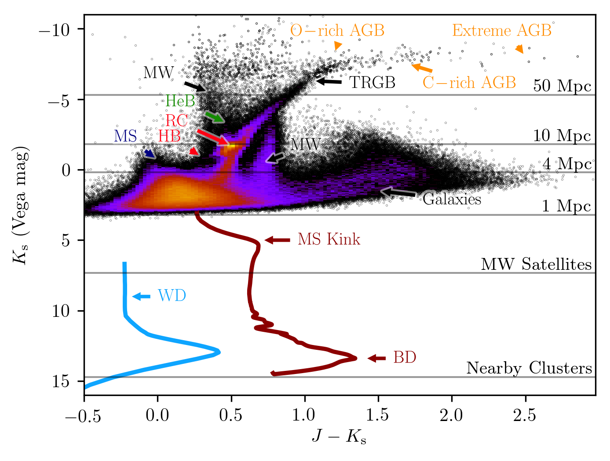

# LMC Figure
Script to make the following figure:

Support for JWST integration times and BD and WD cooling curves require more data files and the global flag jwst = True.

## Data
You will need to unpack [data.tgz](https://goo.gl/zUvcvp) into a directory called data at the same directory level as cmd.py.

